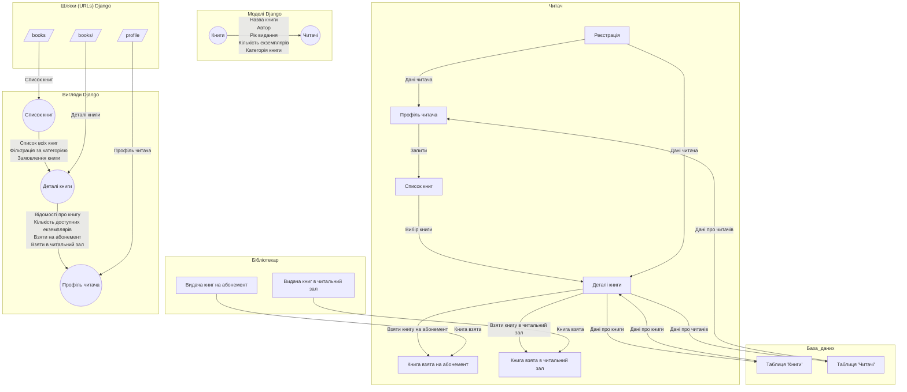

```mermaid
graph TD
    subgraph Читач
        A[Реєстрація] -->|Дані читача| B[Профіль читача]
        B -->|Запити| C[Список книг]
        C -->|Вибір книги| D[Деталі книги]
        D -->|Взяти книгу на абонемент| E[Книга взята на абонемент]
        D -->|Взяти книгу в читальний зал| F[Книга взята в читальний зал]
    end

    subgraph Бібліотекар
        G[Видача книг на абонемент] -->|Книга взята| E
        H[Видача книг в читальний зал] -->|Книга взята| F
    end

    subgraph База_даних
        I["Таблиця 'Книги'"] -->|Дані про книги| D
        J["Таблиця 'Читачі'"] -->|Дані про читачів| B
    end

    subgraph "Моделі Django"
        Books((Книги))
        Readers((Читачі))
        Books -->|Назва книги<br>Автор<br>Рік видання<br>Кількість екземплярів<br>Категорія книги| Readers
    end

    subgraph "Вигляди Django"
        ListBooks((Список книг))
        BookDetails((Деталі книги))
        ReaderProfile((Профіль читача))
        ListBooks -->|Список всіх книг<br>Фільтрація за категорією<br>Замовлення книги| BookDetails
        BookDetails -->|Відомості про книгу<br>Кількість доступних екземплярів<br>Взяти на абонемент<br>Взяти в читальний зал| ReaderProfile
    end

    subgraph "Шляхи (URLs) Django"
        BooksList[/books/] -->|Список книг| ListBooks
        BookDetailsLink[/books/<book_id>/] -->|Деталі книги| BookDetails
        ReaderProfileLink[/profile/] -->|Профіль читача| ReaderProfile
    end

    A -->|Дані читача| D
    D -->|Дані про книги| I
    D -->|Дані про читачів| J
```
